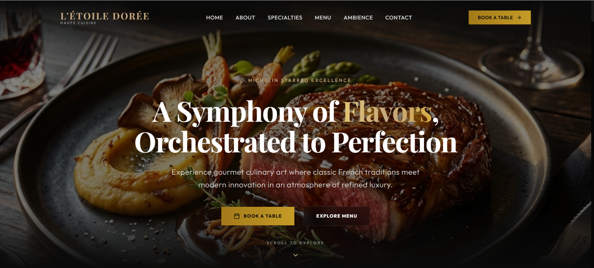
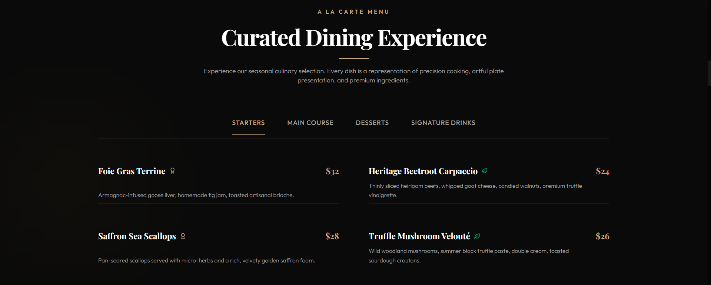
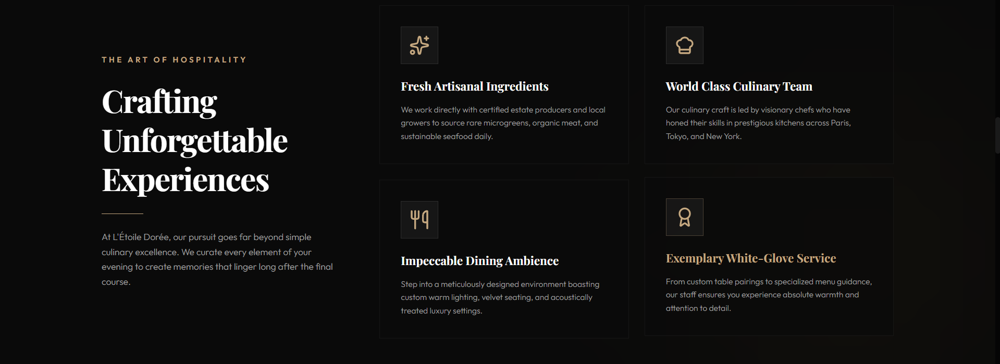
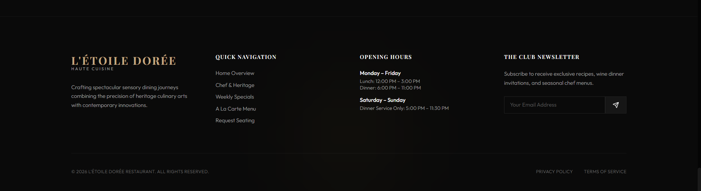

# 🍽️ Restaurant Website (React + Vite)

A modern, responsive restaurant website built using **React + Vite**.  
This project showcases a clean UI, smooth user experience, and responsive design suitable for real-world restaurant businesses.

---

## 🚀 Live Demo
👉 https://restaurant-website-beta-sepia.vercel.app

---

## 📌 Features
- Fully responsive design (mobile + desktop)
- Modern UI/UX layout
- Fast performance using Vite
- Clean and structured code
- Smooth navigation and sections
- Restaurant landing page design

---

## 🛠️ Tech Stack
- React.js
- Vite
- HTML5
- CSS3
- JavaScript (ES6+)

---

## 📂 Project Setup

To run this project locally:

```bash
# Clone the repository
git clone https://github.com/your-username/restaurant-website.git

# Move into project folder
cd restaurant-website

# Install dependencies
npm install

# Start development server
npm run dev

## 📸 Screenshots

### 🏠 Home Page


### 🍽️ Menu Page


### 🏨 Hospitality Section


### 📌 Footer

